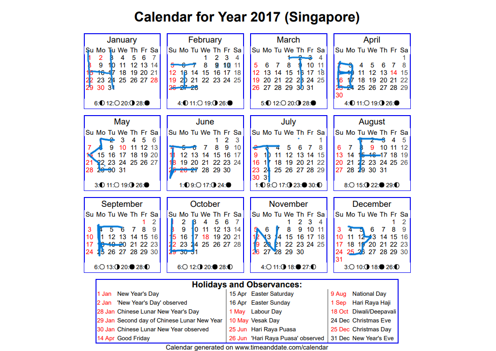

# 我记得这个，神奇小密码
给了一大串数字和一个pdf一看就不一般   

我们仔细看看图，貌似看不出什么端倪，所有手段都用一遍也没有用   
于是我们把目光方向这串神秘数字：01081522291516170310172431-050607132027262728-0102030209162330-02091623020310090910172423-02010814222930-0605041118252627-0203040310172431-0102030108152229151617-04050604111825181920-0108152229303124171003-261912052028211407-04051213192625

不难发现，这串数字，一共有12组数字，猜测每组数字对应一个月，然后每组数字都不超过31，所以数字应该是日期，把日期连起来就是答案了：  

HITB{CTFFUN}