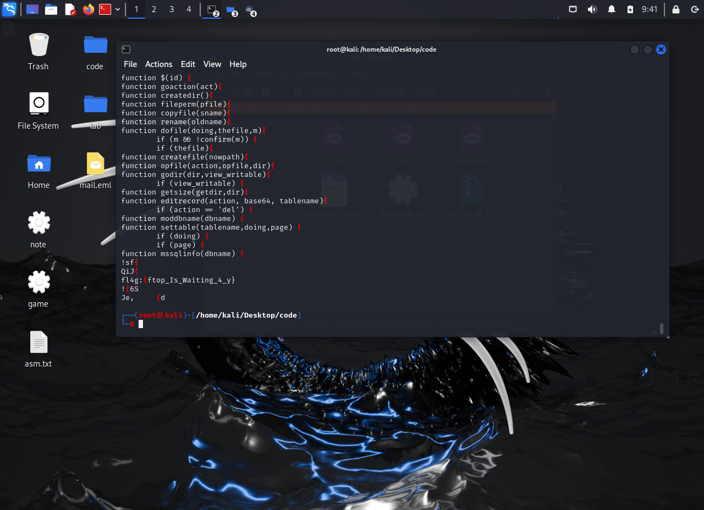

# 心仪的公司   
给了一个流量包，使用wireshark打开看看      
一共有478个流，一个一个翻好像不太现实。于是来试试我新学的玩法      
把流量包复制到kali里，然后用一行神奇的妙妙指令     
`strings webshell.pcapng | grep {`
这样就能找到所有带有{的行（这里的想法是flag一定带有‘{’吧，所以这么用）  
于是找到flag    
  

_kali中strings指令的用法_
`strings 文件名   //输出所有的字符串`
`strings 文件名 | grep “想要查找的字符”`