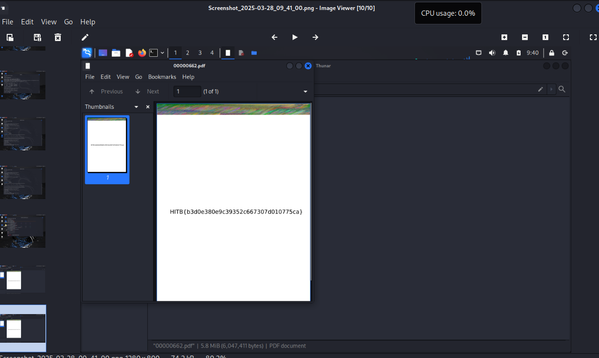

# 我也没见过这种情况啊，一个http都没有啊
怎么辉石呢，我也不会了   
查阅资料得知做法，接下来咱跟着做一遍   
打开统计看分级协议，看看哪个多，最多的tcp，但是没什么用        
额，资料说没有http但是看到了nfs，于是就使用kali打开文件然后分离文件，诶等等nfs是什么啊  

_tips：Network File System即网络文件系统，是FreeBSD支持的文件系统中的一种，它允许网络中的计算机之间通过TCP/IP网络共享资源，出现它说明有文件藏在这个流量包里_   

于是我们也打开kali，然后使用binwalk分离出文件，先输入    
`binwalk 文件名.pcap`
发现有六个文件，我们再输入   
`binwalk -e 文件名.pcap`    
分离出8个文件，但是我一个也看不懂，只是这一行有点可疑，因为带上了‘{}’
`[(H)5(IT)-7(B)5({b)-4(3d)-3(0e3)-3(80e9)-3(c393)-3(52)-3(c667)-3(307)-3(d)-3(010)-3(77)-3(5ca)-3(})]`
但还是看得不是很懂，于是我们再用另一款分离工具foremost,输入    
`foremost 文件名.pcap`   
这次分离出一个pdf文件，打开pdf文件就看到了flag

很蹊跷的一点是用binwalk分离出的文件有flag的尸块，不知道怎么回事
flag：HITB{b3d0e380e9c39352c667307d010775ca}