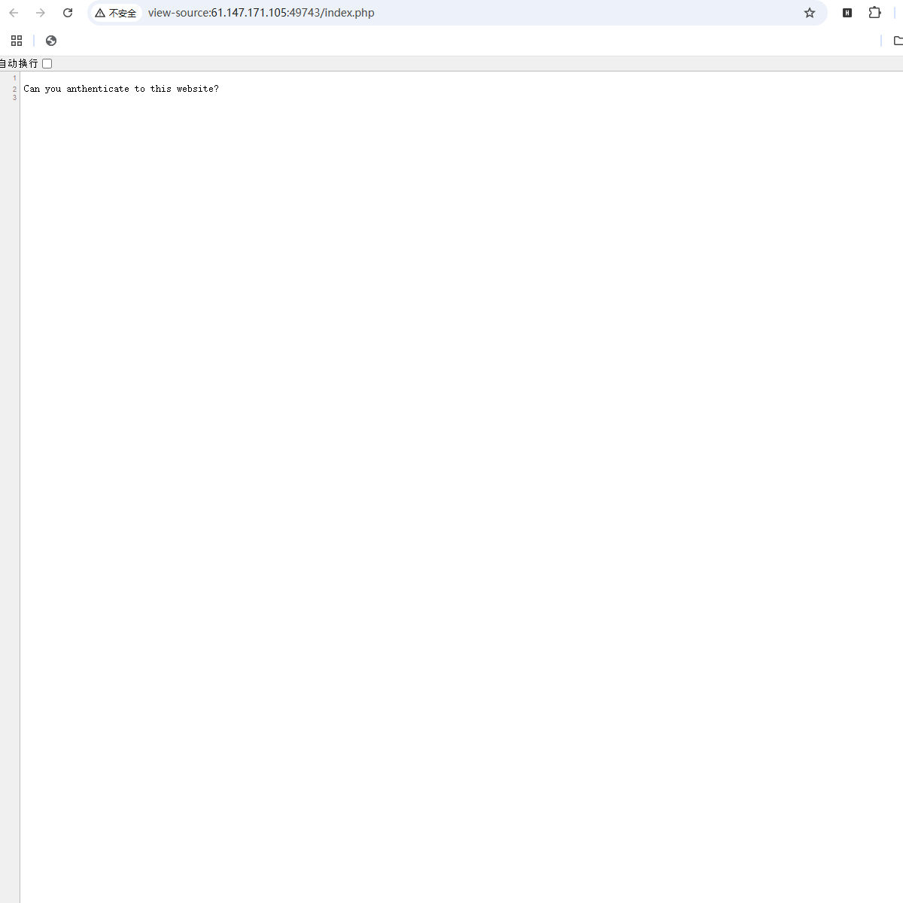
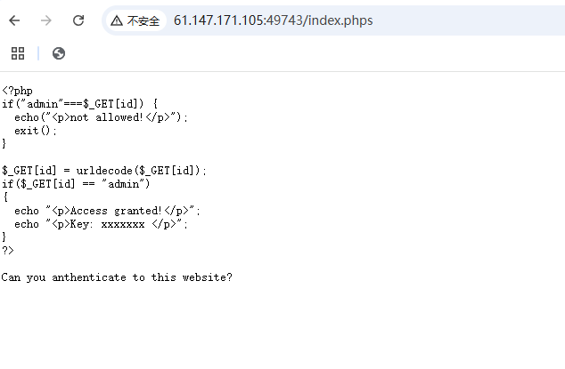
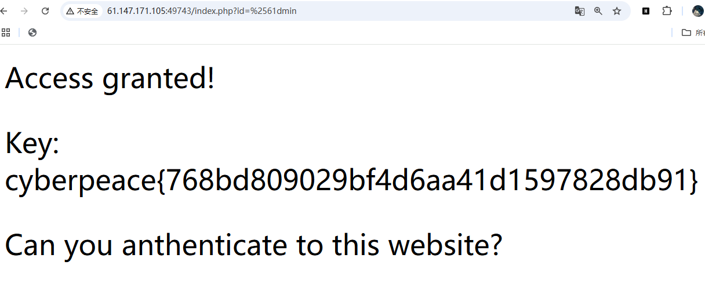

# 没学php还想做web手？
打开环境一看，发现有一行字符   
Can you anthenticate to this website?   
想让我证明这是个网站？那肯定用了html对吧，于是我打开了源文件，发现 
  
怎么感觉不太对劲，还是只有一行字符  
结合题目，这应该是php写的源码吧（但是主包其实并不会php 
#
在经过一小段时间的php大学习以后，主包认识到php的源码一般放在一个.phps的文件里面，一般有index和script这两种命名，于是我们尝试着打开php源代码   
先试试index.phps   

成功打开源码 
_tips:其实可以先尝试打开index.php文件，如果没有报错，就说明存在这样的php脚本文件_
#
然后看看里面写了些什么    
看样子是一个非常简单的过滤，不让输入id=admin  
你说不让输入就不输入？把&变成%25,因为浏览器会自动识别输入的额ur，所以输入的61不用再加%，不然就变成a了。使用url编码轻松绕过（记得加上&）。   
输入`http://61.147.171.105:49743/index.php?id=%2561dmin`

得到flag
cyberpeace{768bd809029bf4d6aa41d1597828db91}
（所以说web手速速去学习php