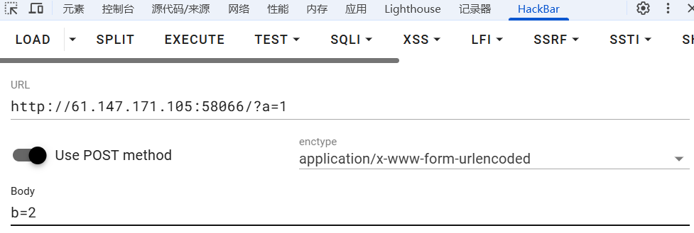

 # 稍微了解了一下http协议
 首先，作为一名ctfer你得知道http协议并不安全，因为http协议都是明文传输，https采用双端加密更为安全  
 
 http是浏览器与服务器之间的通讯协议，GET用于资源读取，POST用于提交表单（所以GET和POST也是协议的一部分）  
 
 后来有了接口格式这种定义，GET和POST作为接口的请求方式    

POST和GET是http的两种请求方式，用于客户端与服务端的信息交互
GET用于读取一个资源，如html页面，css样式文件，图片，js文件等
POST用于提交一个表单，得到一个结果反馈

# 
这是一会要用到的妙妙工具——>    
大概了解以后我们来做一下题目    
打开环境，能看到一行字，叫我们用GET方式提交一个名为a,值为1的变量，我们在url中输入  `?a=1`就能满足要求  
接下来是用POST，本来是不知道怎么用POST方法提交的，f12打开源代码后再打开hackbar一看就懂了  
  
这不就是吗，提交后得到flag  
`cyberpeace{b987eb370a593379fc6dd77ebee0196b}`
