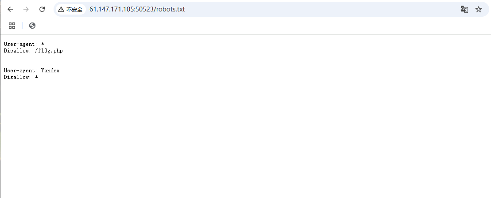

# 看上去很简单
  
给了个环境，打开一看是这样的，于是我用我精湛的英语技巧翻译出了这段话：   
_在这个小小的训练挑战中，您将了解Robots_exclusion_standard。_
_网络爬虫会使用 robots.txt 文件来检查它们是否被允许抓取和索引您的网站或仅抓取其中的一部分。_
_有时这些文件会显示目录结构，而不是保护内容不被抓取。_

享受

文字中提到了文件
_robots.txt_
让我看看里面里面是什么：
在地址栏中输入  
`/robots.txt`
打开了这样一个文件

虽然看得不是很懂，但是它提到了fl0g.php文件，那就再打开看看

得到flag：cyberpeace{3fb73d99a1b5fc4deed251e1311e5f3c}

#
#
#
#
#
#
#
那么这个robots.txt究竟是什么东西呢，查阅资料，大概有了个了解：   

 Robots.txt的作用：

1.可以让蜘蛛更高效的爬行网站；
2.可以阻止蜘蛛爬行动态页面，从而解决重复收录的问题；
3.可以减少蜘蛛爬行无效页面，节省服务器带宽；

如何制作Robots.txt文件？

创建一个文本文档，重命名为Robots.txt，编写规则，用FTP把文件上传到空间；

 

创建robots.txt文件需要注意的问题：

必须是txt结尾的纯文本文件；
文件名所有字母必须是小写；
文件必须要放在网站根目录下；
 

Robots参数：

User-agent：

作用：用于描述搜索引擎蜘蛛的名字；

技巧：

1，当robots.txt不为空的时候，必须至少有一条user-agent的记录；

2，相同名字，只能有一条，但是不同的蜘蛛，可以有多条记录；

 

Disallow：

作用：用于描述不允许搜索引擎蜘蛛爬行和抓取的url；

使用技巧：

在robots.txt中至少要有一条disallow；
Disallow记录为空，则表示网站所有页面都允许被抓取；
使用disallow，每个页面必须单独分开声明；
注意disallow：/abc/和disallow：/abc的区别；
 

Allow：

作用：用于描述搜索引擎蜘蛛爬行和抓取的url；

使用技巧：搜索引擎默认所有的url是Allow；

 

Sitemap：主要作用：向搜索引擎提交网站地图，增加网站收录；

 

注意事项：

可以使用#进行注释；

参数后面的冒号要加一个空格；

参数开头第一个字母要大写；

注意蜘蛛名称的大小写；

 

使用建议：

写完robots.txt文件，到站长平台检查是否有误；

内容越简单越好，遵守规范，不要放置其他内容；

无特殊情况，可以建立空robots.txt文件；

新站不要使用robots.txt文件屏蔽所有内容
————————————————

                            版权声明：本文为博主原创文章，遵循 CC 4.0 BY-SA 版权协议，转载请附上原文出处链接和本声明。
                        
原文链接：https://blog.csdn.net/weixin_44349875/article/details/87912764