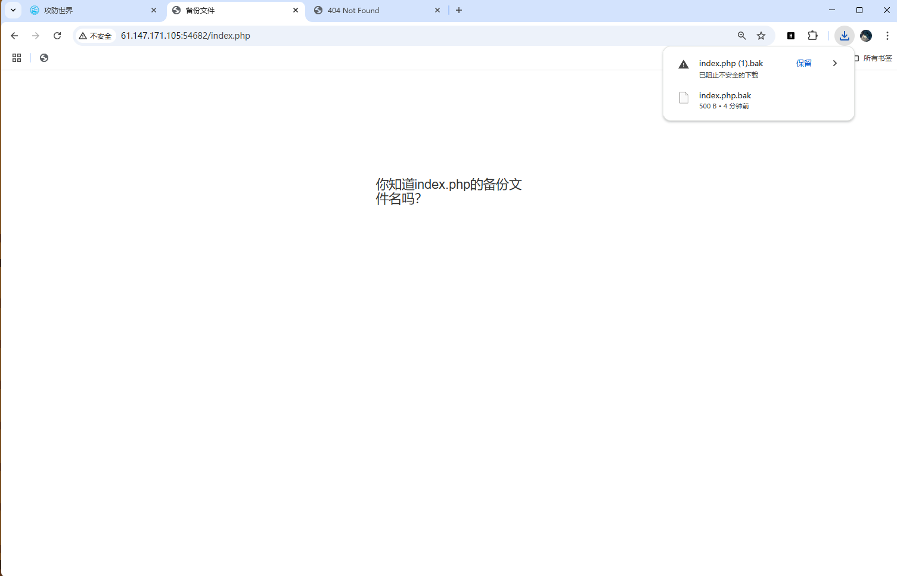

# 主包主包，你什么时候开始学php啊
还是一道要会php才能做的题目，打开环境，很直白地问你index.php的备份文件叫什么，现学现卖。   
我们先输入index.php，发现没反应，再输入index.phps，发现没权限，那没办法，只能老老实实按要求来了，输入index.php,bak,下载得到index.php的备份文件，记事本打开，里面就有flag。

flag:Cyberpeace{855A1C4B3401294CB6604CCC98BDE334}   
#
如果网站存在备份文件，常见的备份文件后缀名有：“.git” 、“.svn”、“ .swp”“.~”、“.bak”、“.bash_history”、“.bkf” 尝试在URL后面，依次输入常见的文件备份扩展名。 