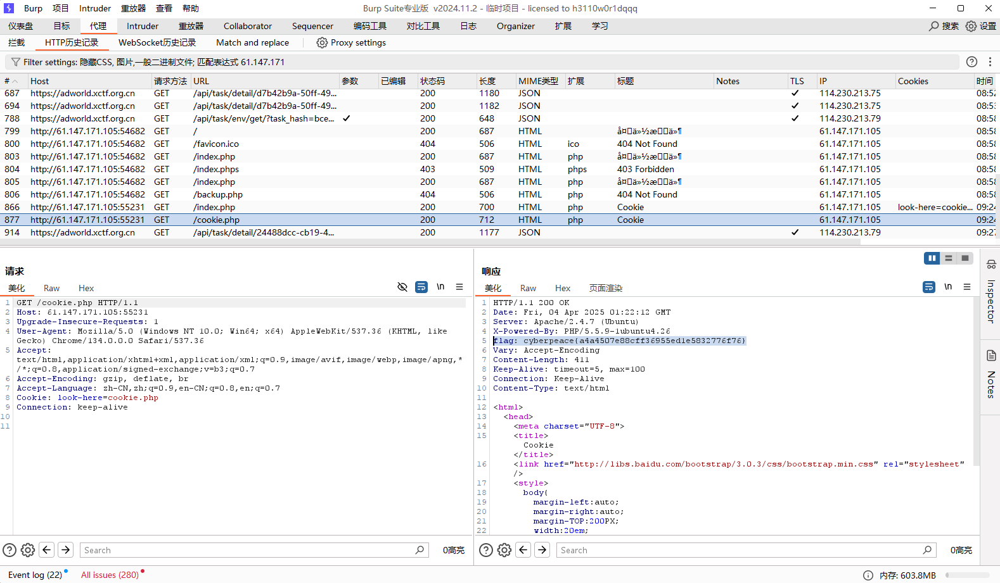
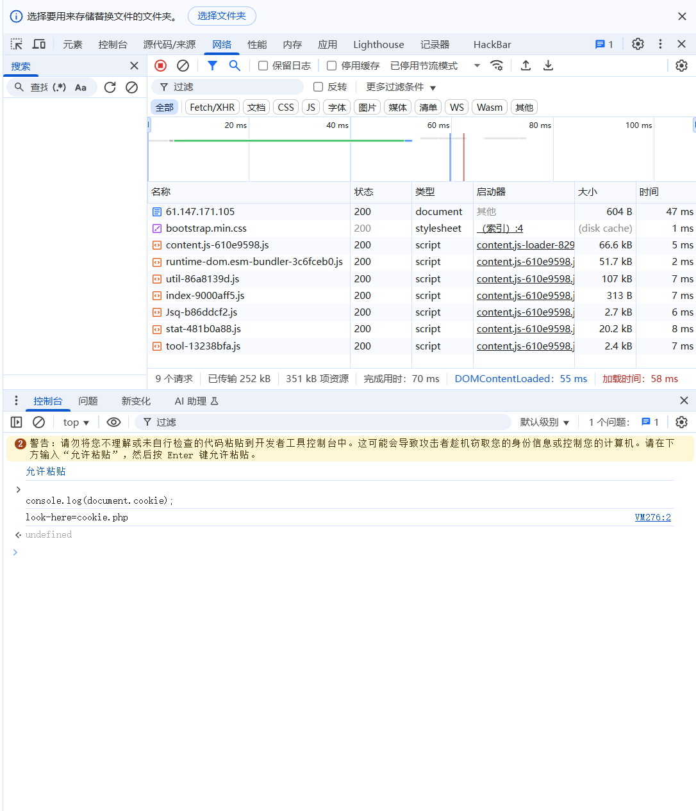
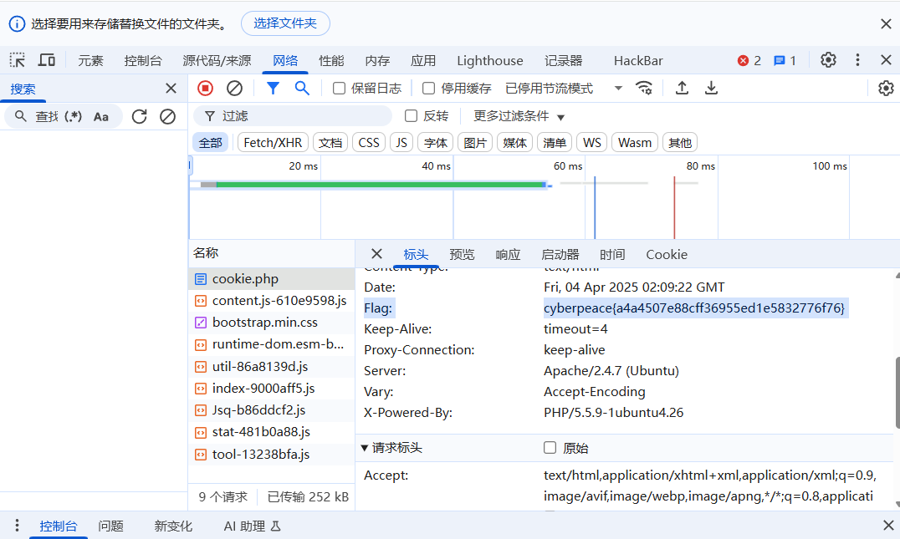

# 所以cookie到底是什么呢
__HTTP cookie__简称cookie，又叫数码存根，~~其实是饼干啦~~  
用途是让服务器端能在客户端存储设备存储状态信息或者是跟踪用户的浏览活动，如点击按钮，历史记录之类的，也是http的一部分，基本结构包括  
1.名；
2.值；
3.各种属性。 
一块cookie可能有Domain、Path、Expires、Max-Age、Secure、HttpOnly等多种属性  
cookie一般分为三类  
__会话cookie__
会话cookie仅在浏览网站时临时存储[25]，关闭浏览器后会自动过期或删除[26]。

__持久cookie__
持久cookie只在其创建者设置的特定日期后过期，期间一直有效。

__安全cookie__
安全cookie只能通过加密连接传输（HTTPS）。它们不能通过未加密的连接传输（HTTP），使cookie不易被盗。

__用途__   
__会话管理__ 
虽然最初引入cookie是为了让用户在浏览网站时记录要购买的物品,但现在用户购物车的内容通常存储在服务器的数据库中，而不再是客户端的cookie中。

当前会话cookie的常见用途是登录。当用户访问网站的登录页面时，Web服务器通常会向客户端发送一个包含唯一会话标识符的cookie。当用户成功登录时，服务器会记住该特定会话标识符已经过身份验证，并授予用户访问其服务的权限。

__喜好设置__
许多网站用cookie存储用户偏好等设置，向用户显示喜好内容。

__跟踪__
跟踪cookie用于跟踪记录用户的网络浏览习惯，如用户的购物习惯。

_所以是不是咱关掉cookie就可以不大数据束缚在信息茧房了？_

概念来源[wiki百科cookie](https://zh.wikipedia.org/zh-cn/Cookie)  
***
概念说完了，接下来开始做题，打开题目环境，又是一页大白话问我们什么是cookie，概念都放上面了，自己看喽  
没什么思路，于是我们打开了刚下好的burpsuit，看看里面有没有什么好康的。
  
非常实在，直接叫我们看cookie.php,那就看吧  
打开来后叫我们看http响应，正好在响应中找到了flag 

***
***
或者我们不用burpsuit，直接用开发者工具也能看到cookie，打开开发者工具，在控制栏里输入`console.log(document.cookie)`（还挺贴心，怕我电脑被盗）  

一样是叫咱看cookie.php文件，
之后是看http的响应，打开开发者工具，点开网络就能看到flag了

flag：cyberpeace{a4a4507e88cff36955ed1e5832776f76}