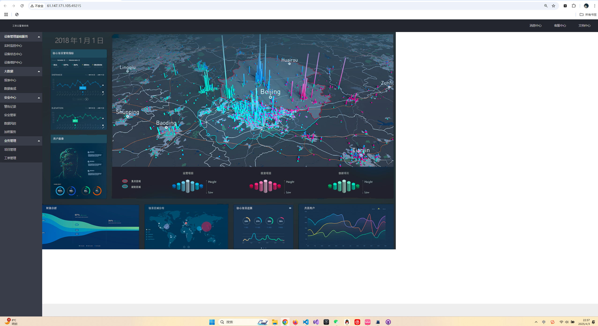
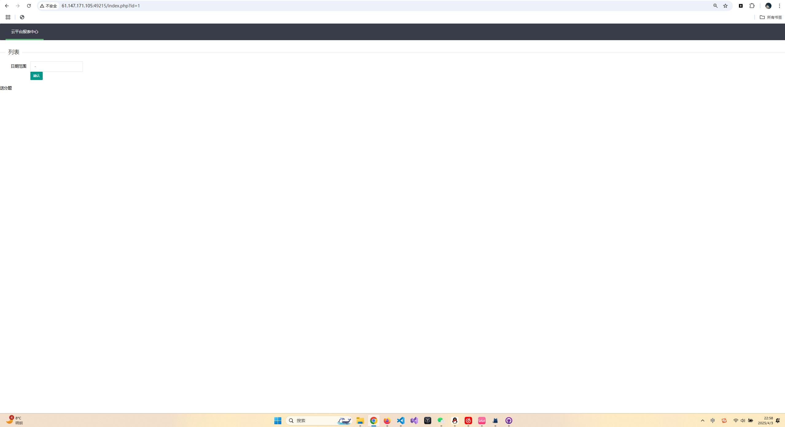
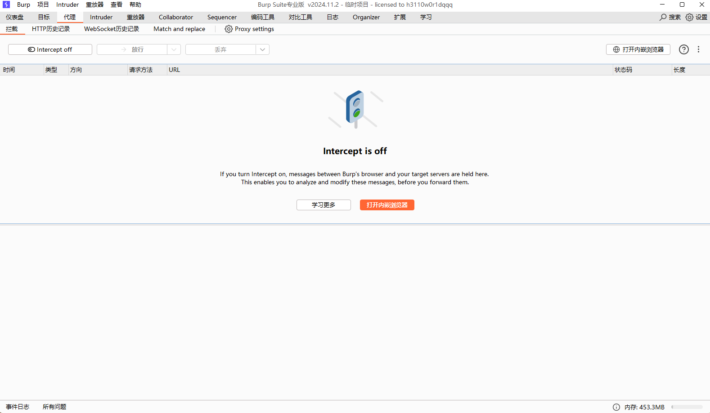
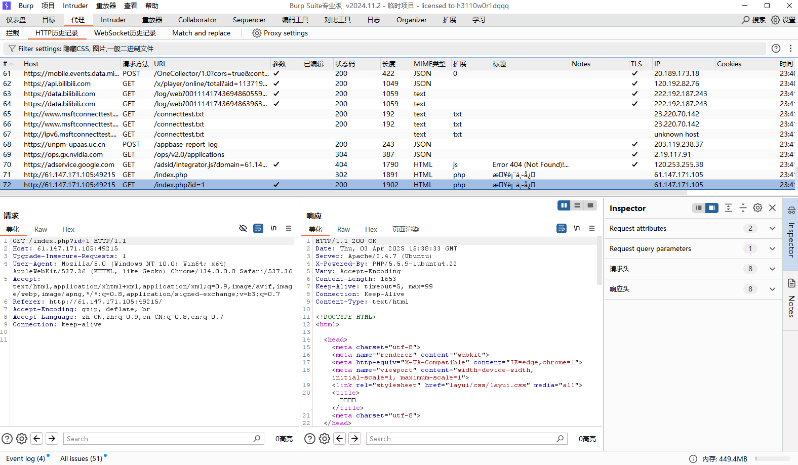
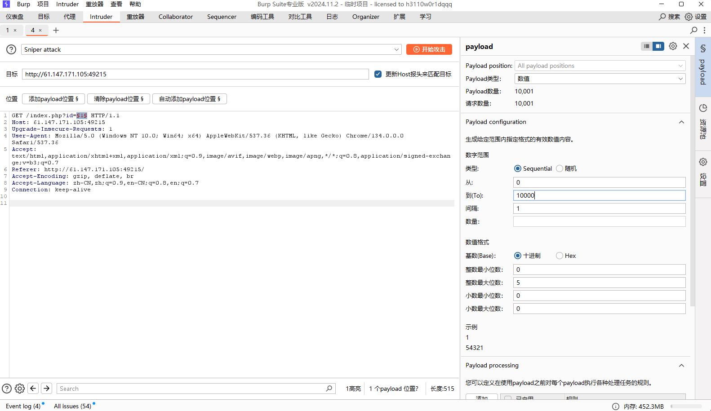
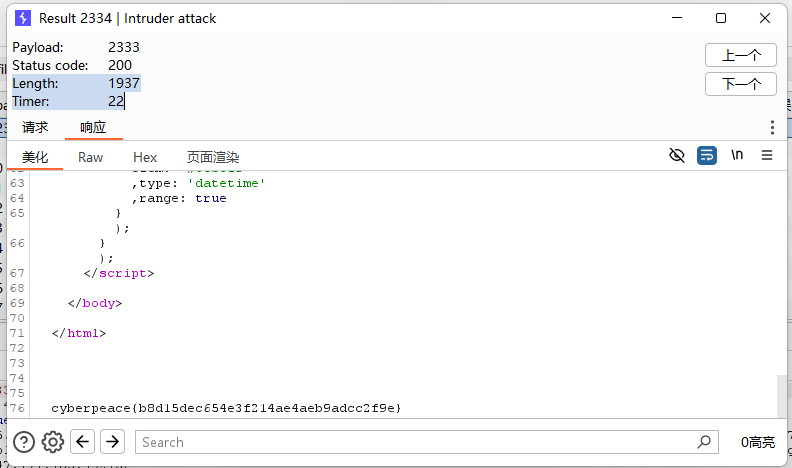

# 又有新工具，还是web必备?!
日常略过题目描述直接打开环境  
  
看样子是一个劣质网站，贴图都没有自适应的，我们随便点点看看，发现只有报表中心能点进（其实这里有更聪明的办法，直接打开源代码就能发现报表中心那里有一个index.php的连接，可以直接点进去)   
   
你这URL里面的id有点显眼啊，我直接开始注入（事实上是错误决定）   
注入了一会，一点破绽都没有，这数据库真行啊，然后直接去看题解（纯粹的菜）  
#
题解告诉我要用一个叫burpsuit的东西去爆破id？为什么是爆破id？   
大佬告诉我，这是经验问题，这种url可以输入不同id但是返回page页类似，返回内容相同的就可以尝试爆破，从1到10000进行访问，比较
_响应长度_
不同  

工具我们使用burpsuit（等会再说burpsuit能干什么），这里主包费了好大的劲才弄好burpsuit，打开burpsuit，来到代理区域，在这里我们可以看到我们在网页中的流量包   
   
但是在这之前，我们要打开这个proxy settings，看到这个端口没有，再打开电脑里的代理设置，有一个手动设置代理的，把端口改成proxy settings里面的或者说在设置里加上你电脑里面的端口，然后刷新一下页面，找到题目环境的访问记录   

右键发送到intruder，在这里我们就可以通过构造payload来攻击啦，点击自动添加payload，它会帮你找到payload应该填充在什么位置，当然也能自己添，我们选择右边payload的类型为数值，然后范围是0 - 10000，设置好后开始攻击  
  
攻击完以后，我们选择这个按长度排序，因为其他的界面都是差不多的，只有这个请求长度多一点，应该是带了flag的，我们点开这个请求来看看响应   

找到flag：`cyberpeace{b8d15dec654e3f214ae4aeb9adcc2f9e}`