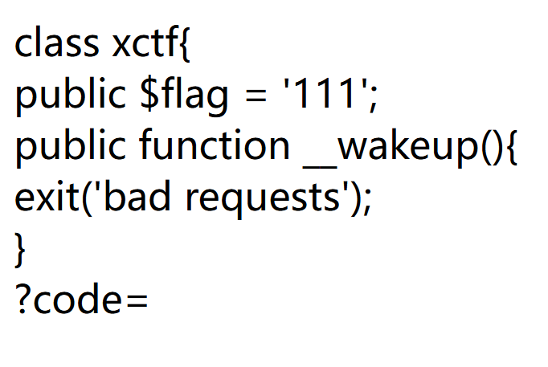

# 标题是什么意思呢
进过短暂的学习时间，标题unserialized是反序列化的意思，序列化和反序列化是php中的概念  

#
_序列化和反序列化：PHP中将数据结构或对象转换为可存储/可传输格式，反序列化即从该格式重建原始数据过程。_

#
打开题目环境，看到了这样的一个类

#
D指导告诉我PHP提供了一些魔术方法来自定义序列化行为，这个wakeup（）就是其中之一，用途是在反序列化以后重新初始化对象。

#
_其他的魔术方法：_  
___sleep(): 在序列化时调用，可以指定要序列化的属性_

___wakeup(): 在反序列化后调用，可以重新初始化对象_

___serialize() (PHP 7.4+): 替代__sleep()，更灵活_

____unserialize() (PHP 7.4+): 替代__wakeup()_

#

结合我们看到的这个类和wakeup的魔术方法,思路应该是我们要输入一个反序列化的对象（就是类里面已经定义好的对象），然后绕过这个wakeup（），就能得到flag，问问D指导怎么反序列化
 
 本来是想问问D指导怎么反序列化的，D指导直接教我怎么绕过wakeup（）检验了

反序列化后的结果是   
`0:4:"xctf":1:{s:4:"flag";s;3:"111";}`  
但是我们需要绕过wakeup（）的检验，所以我们输入的对象不能和xctf类里面的一样，所以我们把属性数改为2

令`?code=0:4:"xctf":2:{s:4:"flag";s;3:"111";}`绕过wakeup（）检验
得到flag： 
cyberpeace{fe025ae95b82a3ad1d4d092b5c055270}
#
 其实可以自己写一个php文件，使用serialize（）来得到序列化后的结果，结果应该是  
 `0:4:"xctf":1:{s:4:"flag";s;3:"111";}`  
 解释一下这些都是什么意思    
 大括号外的:   
 `0`-表示被序列化的是一个对象   
 `4`-表示被序列化的对象名字有4个字符    
 `"xctf"`-表示对象名为这个，   
`1`-表示该对象只有1个属性    
`{}`-表示对象的属性（没有东西就是空）   
`s`-表示属性名类型是字符串   
`4`-表示属性名字有4个字符   
`"flag"`-表示属性名字叫flag    
`s`-表示属性类型为字符串   
`3`-表示属性值111有3个字符   
`"111"`-表示属性值
#