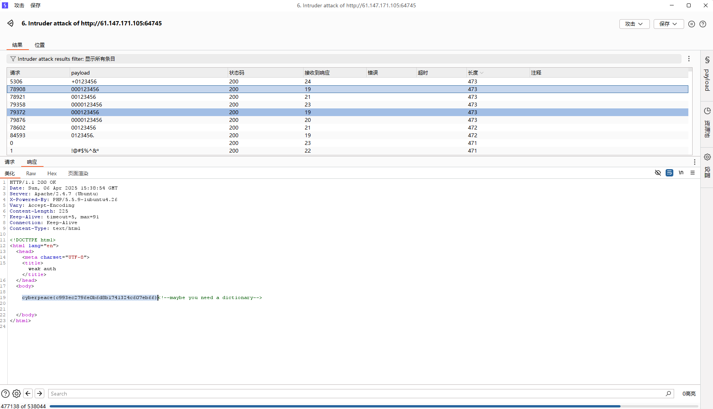

# 弱认证爆破它
题目名字weakauth意思是弱认证，首先我们先看看什么是弱认证：   
弱认证即较弱的安全认证方法或者机制，密码强度过低可能存在安全漏洞，容易受到攻击或者被绕过，在信息安全领域中是一种常见的安全威胁。衡量是否为弱认证的指标是密码强度，一般来说，指一个未授权的访问者得到正确密码的平均尝试次数。密码的强度和其长度、复杂度及不可预测度有关。强密码可以降低安全漏洞的整体风险，但并不能降低采取其他安全措施的需要。（来自[wiki百科](https://zh.wikipedia.org/zh-cn/%E5%AF%86%E7%A0%81%E5%BC%BA%E5%BA%A6)）
***
打开靶机，发现是一个登录界面，随手输入一个名字（主包直接猜测是admin，没想到直接猜对了）  然后输入密码发现有一个check.php的页面来验证密码，check.php咱用什么方法都打不开，那只能老老实实地输入密码了。
既然小明随手设了一个密码，那应该就是弱认证了，我们去找个字典来爆破一下。  
还是打开burpsuit，找到这个check.php的界面，然后发送到intruder，添加payload位置，用我们找到的超级字典开始爆破。  
（右边load可以添加文件）   
然后开始攻击，这还没攻击完呢就出现异象了  
不难发现，所有带123456的payload都有点不一样，查看响应得到flag

flag：cyberpeace{c993ec2796e0b6d8b1741324c607eb66}