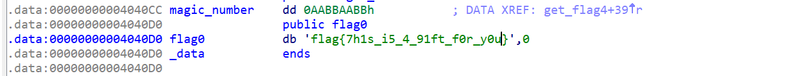
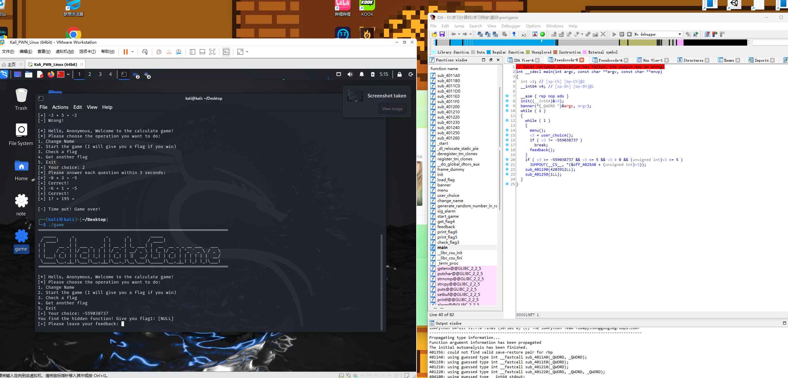
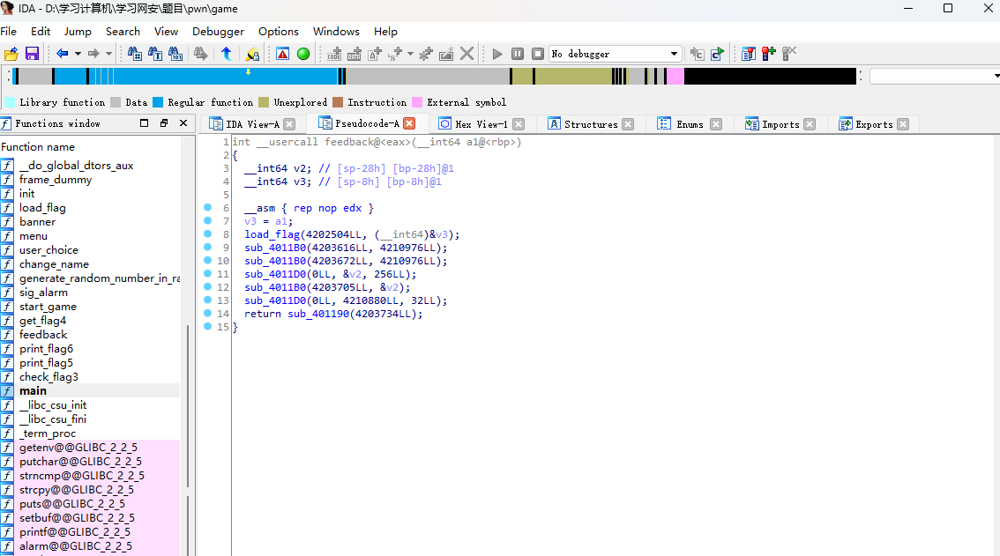
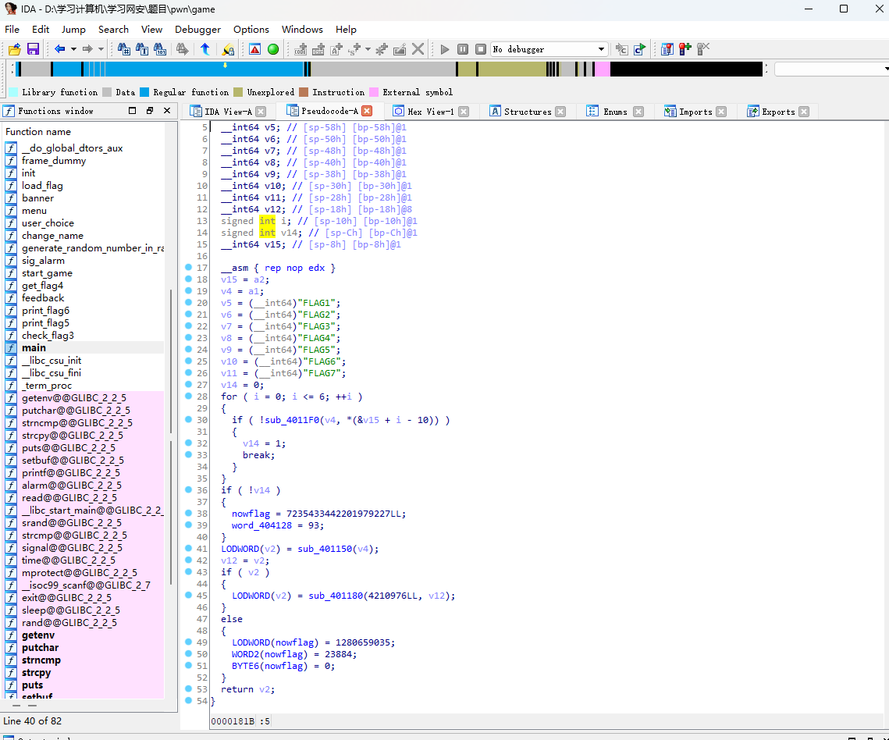
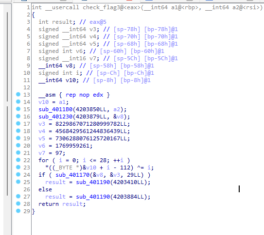
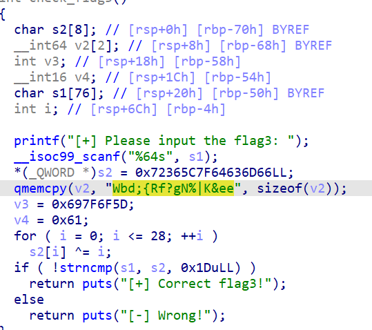
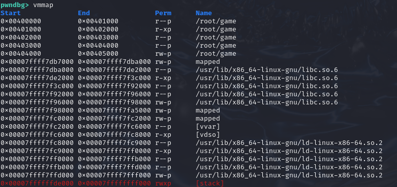

# PWN的题解
#
0.使用ida打开game，发现一份礼物  
  
flag{7h1s_i5_4_91ft_f0r_y0u}  

1.首先使用ida打开game，找到main函数，同时使用kali打开game，然后我们开始尝试。上来就看到一串奇怪的数字-559038737，输入试试，得到第一个空flag（恼）。  
  
下面有个feedback函数的调用，打开来看看  
然后发现，哇，有load_flag欸  
  
2. 再看看旁边一栏有好多的flag，分析发现除了flag3以外的flag都调用了load_flag，然后load_flag把参数nowflag变为了load_flag的返回值  
点开load_flag发现全变成了NULL（恼）  
  
 flag1：[NULL]  
 flag2：[NULL]  
 flag4：[NULL]  
 flag5：[NULL]  
 flag6：[NULL]  
这样就还剩三个flag了  
3. 来看看flag3吧  
  
emmmmm，貌似并不是很好看，我们换一个版本  

这样就好看多了  
发现貌似是异或题，使用这样的一个脚本来进行亦或  
```
#include<stdio.h>
int main(){
    char s[30]={0x66,0x6D,0x63,0x64,0x7f,0x5c,0x36,0x72,'W','b','d',';','{','R','f','?','g','N','%','|','K','&','e','e',0x5d,0x6f,0x7f,0x69,0x61};
    for(int i=0;i<=28;i++){
        printf("%c",s[i]^i);
    }
    return 0;
}
```
得到flag{Y0u_kn0w_h0w_7o_3srEver}
4. 
这道题是唯一的pwn题  
攻击漏洞在哪呢？

在feedback这个输入下是最好的攻击地址，给了0x100这么长，都够手写调用loadflag了  
先gdb看执行区域，可以执行//应该是  
再看没有system("bin/sh")看来ret2shellcode，那还是有难度  
查找rsp得到：0x7fffffffdd90  
现在攻击内容，地址都已经得到，可以开始调试//主要是害怕要栈对齐  
然后就不会了  
_感谢队内只会 reverse 的pwn手的技术支持_